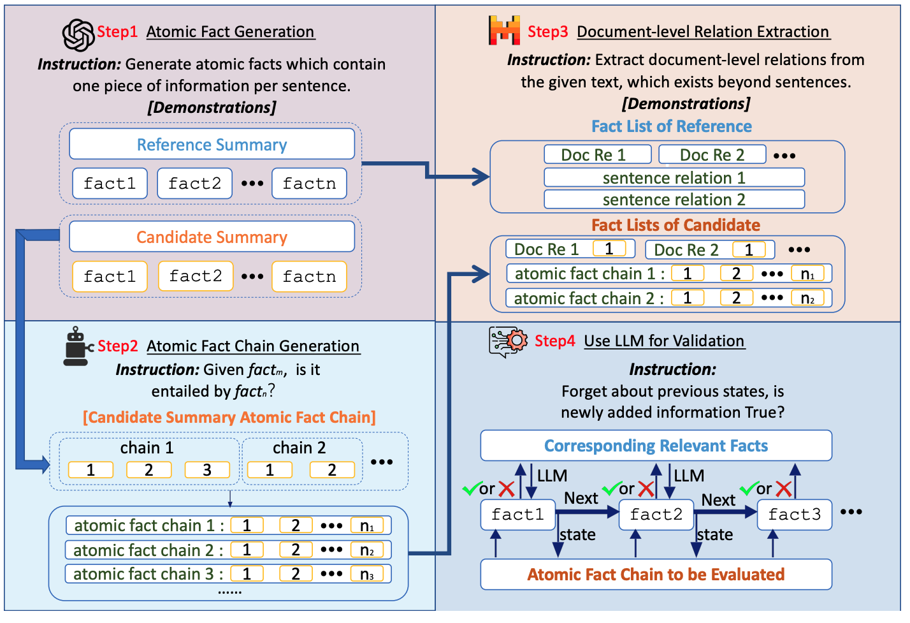
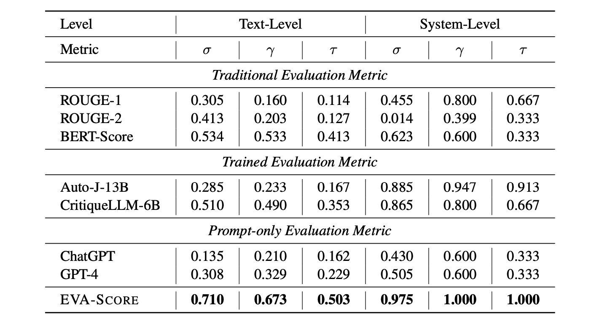

# EVA-Score: Evaluating Abstractive Long-form Summarization on Informativeness through Extraction and Validation

> Since LLMs emerged, more attention has been paid to abstractive long-form summarization, where longer input sequences indicate more information contained. Nevertheless, the automatic evaluation of such summaries remains underexplored. The current evaluation metrics for long-form summarization either use similarity-based metrics like ROUGE and BERTScore or LLM-based metrics using appropriate prompts or pre-defined schema. We argue that the former only relies on similarity and fails to consider informativeness while the latter lacks quantitative analysis of informative richness, and is rather subjective and hard to explain. Current evaluation metrics either use traditional metrics like ROUGE and BERTScore, which rely on surface-level similarity and fail to consider informativeness, or simple LLM-based metrics, which are not robust and easily overwhelmed by the long contexts. In this paper, we propose a new evaluation metric called EVA-Score to extract all information from the given summaries, identify overlapped information based on reference, and calculate the information score. We test EVA-Score on several datasets and the experimental results reveal that EVA-Score shows the highest correlation with humans. We also re-evaluate the performance of LLMs on long-form summarization from the information perspective. The results indicate that responses of LLMs still have a gap with the human-written answers. Moreover, we provide a detailed analysis of the effectiveness of EVA-Score, forecasting future ways to automatically evaluate abstractive long-form summarization.

This is the accompanying code & data for the paper **EVA-Score: Evaluating Abstractive Long-form Summarization on Informativeness through Extraction and Validation**.


## Preliminary Requirements

Install all the dependencies using the following commands
```
conda create -n <your-env-name> python=3.10
pip install -r requirements.txt
```

## Run EVA-Score
To run EVA-Score, you need to prepare the data in the following format:
- `text`: the original text
- `gold_answer`: the gold summary
- `model_pred`: the generated summary

Then, fill the bash file using your models, and run the following command:
```
cd codes
chmod +x run.sh
./run.sh
```

## Results on Long-form Summarization evaluation


## Citation
If you find our work useful, please consider citing SQC-Score:
```
@article{fan2024sqc,
      title={Evaluating Generative Language Models in Information Extraction as Subjective Question Correction}, 
      author={Yuchen Fan, Yantao Liu, Zijun Yao, Jifan Yu, Lei Hou, Juanzi Li},
      year={2024},
      eprint={2404.03532},
      archivePrefix={arXiv},
      primaryClass={cs.CL}
}
```


